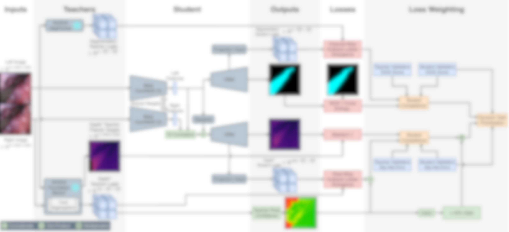
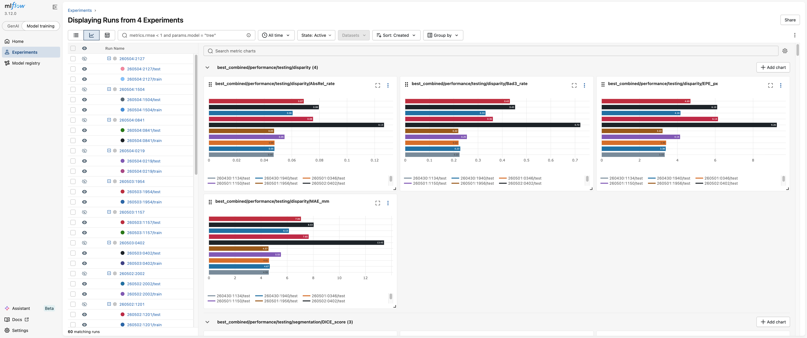

# SIDE: Surgical Instrument Depth & Entity Segmentation

*Multi-task Knowledge Distillation framework for surgical instrument segmentation and stereo disparity estimation - config-driven, fully tracked, modular by design.*

  

---

## Overview

Surgical scene understanding requires simultaneously knowing *what* instruments are present (segmentation) and *where* they are in 3D space (stereo disparity). SIDE trains a shared feature encoder with task-specific decoders for both outputs, using expert teacher models for knowledge distillation and automatic inter/intra-task loss weighting to balance the task-specific training dynamics.

The framework is designed around a single YAML config that fully describes all parameters of an experiment: swap the encoder, toggle tasks, change loss weighting strategies, or enable knowledge distillation with a one-line change. Every run is tracked end-to-end in MLflow with metrics, overlay images, model checkpoints, and a full repository snapshot for reproducibility.

---

## Architecture

*No permission to release yet*



---

## Quick Start

```bash
git clone https://github.com/ZeitDev/SIDE && cd SIDE
pip install uv && uv sync

uv run main.py --config configs/exp06/MT-KD.yaml   	# Choose different configurations
mlflow ui           					# view results on 127.0.0.1:5000 in browser
```

Run the test suite at any time:

```bash
uv run pytest
```

---

## Configuration

All experiment settings live in a single YAML file that inherits from `configs/base.yaml`.  Experiment subconfigs override only what they change:

```yaml
# configs/exp06/MT-KD.yaml - enable both tasks with fixed-ratio distillation weighting
description: Experiment 06 - Multi-Task Knowledge Distillation

training:
  tasks:
    segmentation:
      enabled: true          # toggle task on/off
      distillation:
        enabled: true        # toggle knowledge distillation independently
    disparity:
      enabled: true
      distillation:
        enabled: true

  weighting:
    inter:
      name: criterions.weighting.Unweighted   # swap strategy by changing class path
    intra_segmentation:
      name: criterions.weighting.Fixed
      params:
        weights: {target: 0.5, distillation: 1.5}
```

All viable parameters accept both standard Python modules and custom defined ones. Function parameters are accepted, but do not throw errors and parameters do not inherit from the base configuration! `configs/base.yaml` exposes the full surface area of the framework:

| Module               | Config key                                     | Example values                                       |
| -------------------- | ---------------------------------------------- | ---------------------------------------------------- |
| Encoder              | `training.encoder.name` + `model_name`     | `convnextv2_tiny`, `convnextv2_base`             |
| Segmentation decoder | `training.tasks.segmentation.decoder.name`   | `models.decoders.segmentation.SegmentationDecoder` |
| Disparity decoder    | `training.tasks.disparity.decoder.name`      | `models.decoders.disparity.DisparityDecoder`       |
| Optimizer            | `training.optimizer.name`                    | `torch.optim.AdamW`                                |
| LR scheduler         | `training.scheduler.name`                    | `schedulers.custom.WarmupCosineAnnealingLR`        |
| Seg loss             | `training.tasks.segmentation.criterion.name` | `monai.losses.DiceCELoss`                          |
| Disp loss            | `training.tasks.disparity.criterion.name`    | `criterions.disparity.MaskedL1Loss`                |
| Inter-task weighting | `training.weighting.inter.name`              | `DynamicTaskPriority`, `Unweighted`              |
| Intra-task weighting | `training.weighting.intra_*.name`            | `CompetenceDecay`, `Fixed`, `Unweighted`       |
| Distillation         | `training.tasks.*.distillation.enabled`      | `true` / `false`                                 |
| Transforms           | `data.transforms.train`                      | composable list of named transform classes           |

---

## Features

**Tasks & Metrics**

- Surgical instrument segmentation: IoU Score, DICE Score (instrument mean, per class)
- Stereo disparity estimation: AbsRel Rate, Bad3 Rate, EPE Pixel, MAE mm

**Training Modes**

- Validation training (train/val split) or full training (all data, no val)
- EMA-tracked best checkpoints: per-task (segmentation, disparity) and combined harmonic mean metric
- Finetuning from a pretrained checkpoint with frozen encoder
- Custom datasets via `data/datasets.py`

**Architecture**

- Modular shared encoder + separate task decoders
- Stereo-compatible decoder design
- Encoder LR modifier: keeps pretrained weights stable during early training

**Knowledge Distillation**

- Independent teacher per task (segmentation + disparity)
- KL divergence loss with temperature scaling
- Offline distillation (logits from disk) or MLflow model URI
- Teacher operate at 1/4 resolution / 1/4 max disparity

**Loss & Optimization**

- Dynamic task priority weighting (inter-task): reacts to relative task performance
- Student Competence decay weighting (intra-task): progressively shifts from teacher to task loss as student improves
- Cosine annealing with linear warmup
- LR finder (fastai-style exponential sweep)

**Experiment Tracking**

- Full MLflow run hierarchy: experiment → CV folds → test (see below)
- Per-epoch metrics, loss weights, overlay images saved as artifacts
- Complete config snapshot in run parameters
- Repository snapshot saved in run artifacts

**Developer Tools**

- Test cases for central components
- Evaluation notebooks
- uv for reproducible packaging, Ruff is recommended

---

## MLflow Experiment Tracking

Every training run produces a structured hierarchy of MLflow sub-runs, which can also be inspected with Python pandas:

```
Experiment (Exp01, Exp02, ...)
└── Config (SEG, DISP, MT, MT-KD)
    └── Seed-Run (e.g. 251125:1636, ...)
        │
        ├── Parameters: complete config snapshot (propagated to all sub-runs)
        ├── Artifacts:  repository snapshot, log file
        ├── Tags:       description, run type
        │
        ├── 251125:1636/train
        │   ├── Metrics (per log interval, ~5% of epoch)
        │   │   ├── LR encoder + LR decoders
        │   │   ├── Inter-task loss, intra-task losses per task
        │   │   ├── Inter/intra loss weights per task
        │   │   └── Raw criterion losses
        │   ├── Metrics (per epoch, validation)
        │   │   ├── Validation loss (weighted + raw per task)
        │   │   ├── Segmentation: IoU, DICE (mean, per class)
        │   │   ├── Disparity: Bad3, EPE, MAE, AbsRel
        │   │   ├── Intercept metrics (decoder mid-features quality)
        │   │   └── EMA-smoothed metrics + combined heuristic
        │   ├── Best-epoch snapshots (logged when EMA improves)
        │   │   ├── best/segmentation/* - best EMA DICE epoch
        │   │   ├── best/disparity/*   - best EMA AbsRel epoch
        │   │   └── best/combined/*    - best harmonic mean epoch
        │   └── Models: best_model_segmentation, best_model_disparity, best_model_combined
        │
        └── 251125:1636/test
            └── Metrics: test IoU + DICE / AbsRel + Bad3 + EPE + MAE for each best model variant
```

Example MLflow dashboard view in *compare* mode, showing the metrics for all runs of four configurations (named *Experiments* in MLflow)


---

## Results

*in progress*

---

## Technical Notes

### Dynamic Task Priority (inter-task weighting)

Weight per task: `-(1-κ)^γ · log(κ)`, where κ is EMA of task performance (score, or `1-rate` for error metrics like AbsRel). Lower-performing tasks receive higher weight. `γ` controls attenuation: higher values penalize the winning task more aggressively. `alpha` controls EMA smoothing speed. Weights are normalized to sum to N tasks.

### Competence Decay (intra-task weighting)

`weight_distillation = max(0, (student_error_ema - teacher_error) / student_error_ema)`
The relative performance gap between student and teacher. Starts near 1.0 (heavy distillation) and decays toward 0.0 as the student closes in on the teacher. `inverse=True` flips the schedule. `alpha` controls EMA smoothing speed of the student error.

### KL Divergence - Segmentation (ChannelWiseKLDivLoss)

Softmax over flattened spatial positions: each class becomes a distribution over pixels. Loss summed then divided by `B·C` (mean over batch and classes), scaled by `T²`. Segmentation projection head operates at 1/4 resolution to match SegFormers logits shape.

### KL Divergence - Disparity (PixelWiseKLDivLoss)

Softmax over disparity bins: each pixel becomes a distribution over bins. Per-pixel KL optionally weighted by the teacher's confidence map. Averaged over valid pixels only (targets > 0), scaled by `T²`. Distillation projection head operates at 1/4 resolution to match FoundationStereo logits shape.

### Loss Normalization in LossComposer

Before any weighting, each raw loss is divided by its initial value (EMA-estimated over the first 100 steps). This maps all losses to ~1.0 at training start regardless of their absolute scale, making inter/intra weights comparable across tasks and criteria. The combined inter-loss is further divided by the total number of active criteria.

### Negative Loss Values with Automatic Weighting

When a task's raw loss approaches 0, the uncertainty weight `s` can go negative so that `e^{-s}` increases: the optimizer is maximizing confidence. This is expected behavior: e.g. `e^{-s} * L_raw + 0.5 * s = 5.0 * 0.0001 + 0.5 * (-2) = -1`.

### Teacher at 1/4 Resolution

FoundationStereo outputs disparity probability distributions at 1/4 spatial resolution and 1/4 max disparity: `[B, max_disparity/4, H/4, W/4]`. The student decoder intercepts feature maps (projection head) at the corresponding resolution to align the distillation target. Segmentation behaves similary.

### Metric Accumulation vs. MSDESIS

This project accumulates metrics across the full dataset before averaging (weighted by valid pixel count), whereas the paper MSDESIS averages per image then per batch. The SIDE approach prevents outlier images from disproportionately skewing epoch-level metrics.

---

## Acknowledgements

Developed as a Master's thesis by Léon Zeitler, supervised by Lennart Maack.
